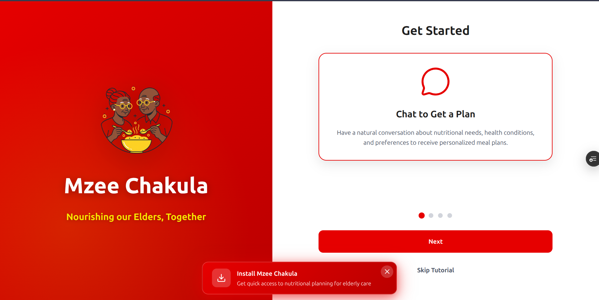

# MzeeChakula - AI-Powered Nutrition Assistant 🇺🇬

**MzeeChakula** is an intelligent nutrition assistant designed specifically for the elderly in Uganda. It leverages advanced AI to provide personalized dietary advice, meal planning, and health monitoring, all accessible through a user-friendly interface with support for local languages and voice interaction.



## Live Demo

- **Frontend (User Interface):** [https://mzeechakulaaissistant.vercel.app](https://mzeechakulaaissistant.vercel.app)
- **Backend (API Docs):** [https://mzeechakula-user-interface-backend.onrender.com/docs](https://mzeechakula-user-interface-backend.onrender.com/docs)

## System Architecture

```bash
+-------------+          +------------------+          +------------------+
|   User      | -------> | Frontend (Vue 3) | -------> | Backend (FastAPI)|
+-------------+          +------------------+          +------------------+
                                                                |
                                                                |
                                       +------------------------+------------------------+
                                       |                        |                        |
                                       v                        v                        v
                              +----------------+       +----------------+       +----------------+
                              |    Supabase    |       |    ChromaDB    |       |   AI Services  |
                              |  (PostgreSQL)  |       | (Vector Store) |       | (OpenAI/Groq,  |
                              +----------------+       +----------------+       |  Sunbird, HF)  |
                                                                                +----------------+
```

## Key Features

- **AI Nutritionist Chat:** Interactive chat powered by RAG (Retrieval-Augmented Generation) to answer questions about nutrition, specifically tailored to Ugandan local foods and dietary needs.
- **Smart Meal Planning:** Generate personalized weekly meal plans based on health goals, dietary restrictions, and available ingredients. Export plans to PDF.
- **Voice & Language Support:** 
    - Voice-to-text and text-to-speech capabilities for accessibility.
    - Real-time translation for local Ugandan languages (Luganda, Acholi, Ateso, Lugbara, Runyankole) powered by **Sunbird AI**.
- **Food Analysis:** Advanced nutrition analysis using an ensemble of machine learning models (XGBoost, Hugging Face embeddings) to estimate calories and nutritional content.
- **Document Analysis:** Upload medical or dietary documents (PDF) for the AI to analyze and incorporate into its advice.

## Tech Stack

### Frontend
- **Framework:** Vue 3 (Composition API)
- **Build Tool:** Vite
- **Styling:** TailwindCSS + Custom CSS
- **State Management:** Pinia
- **Routing:** Vue Router
- **HTTP Client:** Axios

### Backend
- **Framework:** FastAPI (Python)
- **Database:** Supabase (PostgreSQL)
- **Vector Store:** ChromaDB (for RAG)
- **AI/ML:** 
    - LangChain (Orchestration)
    - Hugging Face (Embeddings & Ensemble Model)
    - OpenAI / Groq (LLM)
    - Sunbird AI (Translation)
- **Deployment:** Docker

## Local Development Setup

### Prerequisites
- Node.js (v18+)
- Python (v3.10+)
- Docker (optional, for containerized run)

### 1. Backend Setup

```bash
cd backend

# Create virtual environment
python -m venv venv
source venv/bin/activate  # On Windows: venv\Scripts\activate

# Install dependencies
pip install -r requirements.txt

# Set up environment variables
cp .env.example .env
# Edit .env with your API keys (OpenAI, Supabase, Sunbird AI, etc.)

# Run the server
uvicorn api.main:app --reload
```
The API will be available at `http://localhost:8000`.

### 2. Frontend Setup

```bash
cd frontend

# Install dependencies
npm install

# Set up environment variables
cp .env.example .env.local
# Ensure VITE_API_BASE_URL=http://localhost:8000

# Run the development server
npm run dev
```
The application will be available at `http://localhost:5173`.

## Docker Deployment

The backend is fully containerized.

```bash
# Build and run with Docker Compose
docker-compose up --build
```

## Testing

The project includes comprehensive test suites for both frontend and backend.

- **Frontend:** `npm test` (Vitest)
- **Backend:** `pytest`

## License

This project is licensed under the MIT License.
